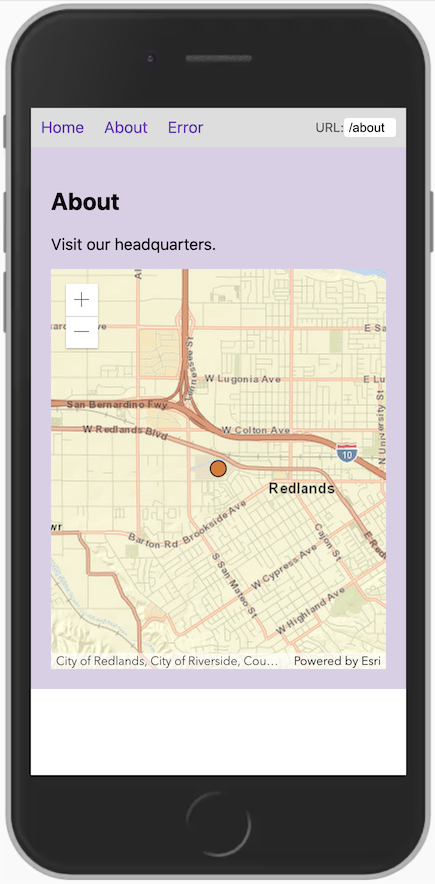

# Esri WMR

This is an example of how to use the [ArcGIS API for JavaScript](https://developers.arcgis.com/javascript/) in a [Preact](https://preactjs.com/) application that has been bootstraped with [WMR](https://github.com/preactjs/wmr).

## Available Scripts

### yarn start

Runs the app in the development mode.
Open http://localhost:8080 to view it in the browser.

The page will reload if you make edits.

### yarn build

create a production build in the  `dist/` folder.

### yarn serve

Serve that production build for easy local testing.

See the [WMR documentation](https://github.com/preactjs/wmr) for more information.
